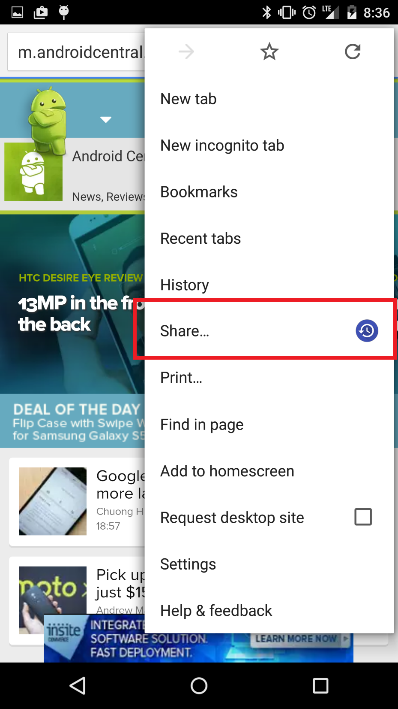
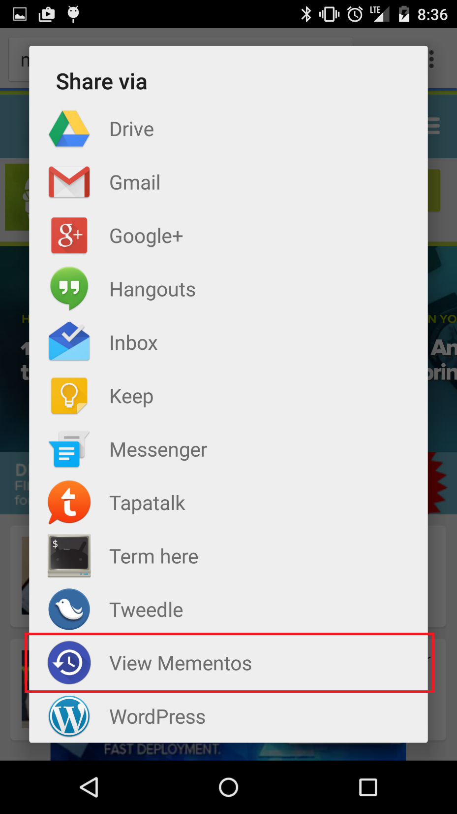
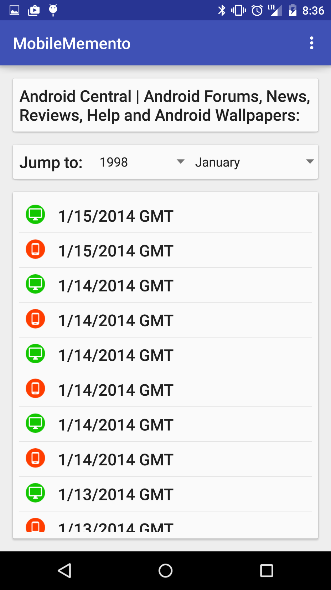
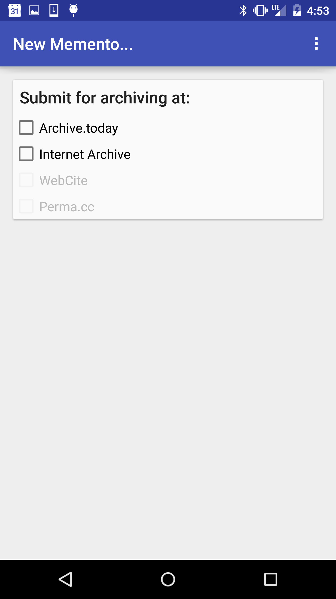

# MobileMink
An Android Application that bridges the mobile and desktop Webs. MobileMink uses URI permutations to discover mobile and desktop version of the same resources and provides the user an aggregate TimeMap of mobile and desktop mementos. It also provides the opportunity to submit the mobile and desktop URI-Rs to the Save Page Now service at the Internet Archive and archive.today. MobileMink relies on the [Memento Framework](https://tools.ietf.org/html/rfc7089).

## Usage

1. After installing MobileMink, browse to a web page of your choice and select the Share button (Figure 1).
2. Select the option to "View Mementos" from the list of "Share via" (Figure 2).
3. View the dates for which mementos (past representations) of the web page are available with the mobile or desktop representation iconically noted (Figure 3).
4. Alternatively, submit the URI-R of the web page to a selection of available web archiving services (Figure 4).

|||
:--:|:--:|:--:|:--:
Figure 1|Figure 2|Figure 3|Figure 4

## Development

_Notes to come to describe dev process_ ([#23](https://github.com/oduwsdl/MobileMink/issues/23), [#18](https://github.com/oduwsdl/MobileMink/issues/18))

## Installation

The app is currently only available via a [beta APK (1.04 MB)](https://github.com/Thing342/MobileMemento/releases/download/0.6/mobileMink-0.6-release.apk) (last updated 8 May 2015 at 12:46 EDT)

### Tasks
- [ ] Release APK from this repository ([#21](https://github.com/oduwsdl/MobileMink/issues/21))
- [ ] Explore dynamics of releasing to the Google Play Store to mitigate need for manual APK installation ([#24](https://github.com/oduwsdl/MobileMink/issues/23)), from [this blog post](https://ws-dl.blogspot.com/2015/06/2015-06-09-mobile-mink-merges-mobile.html) (June 2015), "We plan to release Mobile Mink in the Google Play store in the next few weeks". 

## More Information and Citing Project

* [2-page summary fro ACM/IEEE JCDL 2015 (PDF)](https://github.com/oduwsdl/MobileMink/raw/master/meta/2015_jcdl_mobileMink.pdf)

> Wesley Jordan, Mat Kelly, Justin F. Brunelle, Laura Vobrak, Michele C. Weigle, and Michael L. Nelson. __Mobile Mink: Merging Mobile and Desktop Archived Web__. In _Proceedings of the ACM/IEEE Joint Conference on Digital Libraries (JCDL)_, Knoxville, TN, June 2015, pp. 243-244.

```latex
@INPROCEEDINGS { jordan-jcdl2015,
    AUTHOR = { Wesley Jordan and Mat Kelly and Justin F. Brunelle and Laura Vobrak and Michele C. Weigle and Michael L. Nelson },
    TITLE = { Mobile Mink: Merging Mobile and Desktop Archived Webs },
    BOOKTITLE = { Proceedings of the ACM/IEEE Joint Conference on Digital Libraries (JCDL) },
    YEAR = { 2015 },
    MONTH = { June },
    NOTE = { Best Poster Award },
    PDF = {https://github.com/oduwsdl/MobileMink/raw/master/meta/2015_jcdl_mobileMink.pdf },
    ADDRESS = { Knoxville, TN },
    PAGES={243--244},
    DOI = {10.1145/2756406.2756956}
}
```

